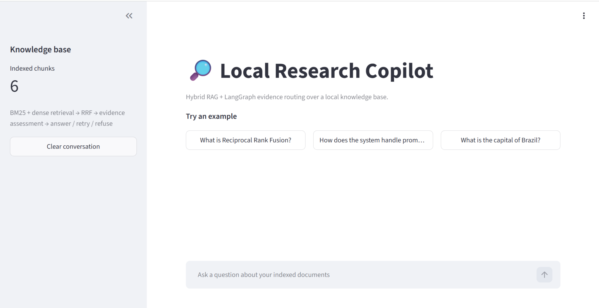
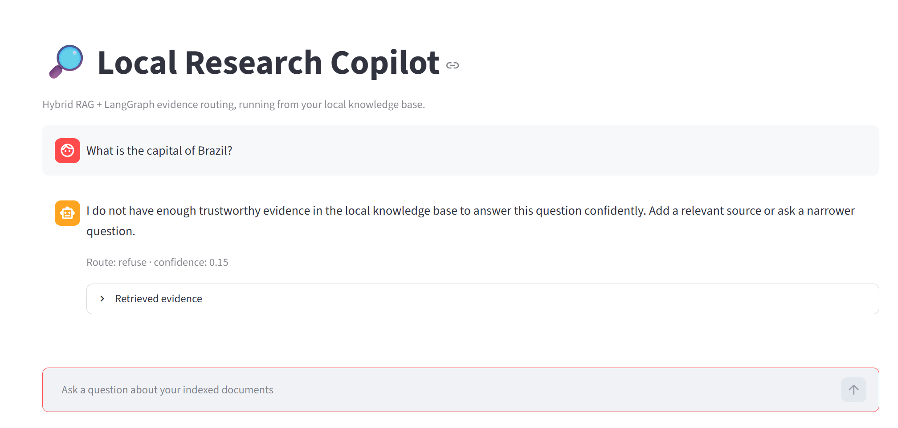
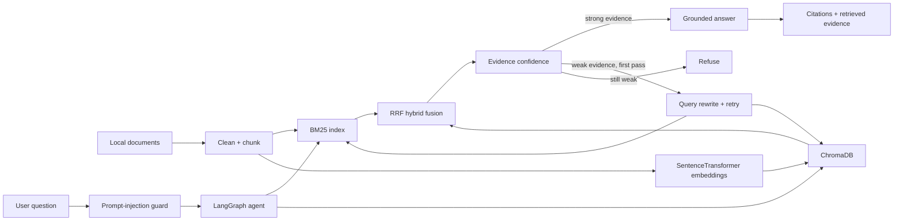
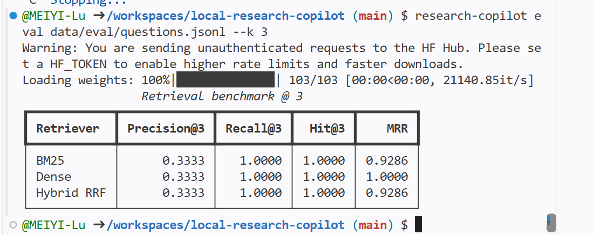

# Local Research Copilot — Hybrid RAG + Agentic Verification

[](https://github.com/MEIYI-Lu/local-research-copilot/actions/workflows/tests.yml)


A local-first research assistant that combines **BM25 lexical retrieval**, **dense embeddings**, **ChromaDB**, and **Reciprocal Rank Fusion (RRF)** with a small **LangGraph agent** that checks evidence before deciding whether to answer, retry retrieval, or refuse.

The repository is designed as a reproducible portfolio project rather than a single-notebook demo. It includes a CLI, Streamlit web app, labelled retrieval benchmarks, prompt-injection filtering, citation grounding, tests, CI, and a zero-API extractive fallback.

## Demo

The Streamlit interface exposes the knowledge-base size, example questions, confidence, routing decisions, and retrieved evidence:



*UI smoke-test screenshot from the v0.2 six-document corpus; the v0.3 sample corpus contains 24 documents.*

A deliberately out-of-domain question is refused instead of answered from unrelated model knowledge:



## What changed in v0.3.1

The evaluation layer is now less toy-like and more diagnostic, and the measured v0.3 benchmark is documented below:

- sample corpus expanded from **6 to 24 documents**;
- evaluation set expanded from **7 to 30 labelled questions**;
- questions are split into **lexical**, **semantic**, and **multi-evidence** groups;
- multi-evidence questions can have two or three relevant documents, making Precision@K more informative;
- CLI evaluation now reports both **overall** and **per-query-type** results;
- the original v0.2 benchmark is preserved for reproducibility;
- the measured 30-query benchmark is now documented in the README.

## Why this project exists

Many RAG examples stop at “embed documents and ask a question.” This project focuses on engineering choices that make retrieval behaviour easier to inspect and evaluate:

- lexical + semantic retrieval instead of relying on one retriever;
- RRF to fuse rankings without comparing incompatible raw scores;
- persistent local vector storage with ChromaDB;
- explicit evidence-confidence routing;
- one retrieval retry using a rewritten query;
- grounded answers with chunk-level citations;
- refusal when evidence remains weak;
- prompt-injection checks on both user input and retrieved evidence;
- reproducible BM25 vs dense vs hybrid evaluation;
- automated tests and GitHub Actions.

## Architecture



### What makes the workflow agentic?

The LangGraph state records the current query, retrieved evidence, confidence, retry count, route, answer, and citations. The next action depends on that state:

```text
question
   ↓
guard
   ↓
retrieve
   ↓
assess evidence
   ├── strong ─────────────→ answer
   └── weak
        ├── first attempt ─→ rewrite → retrieve again
        └── after retry ───→ refuse
```

The default non-LLM mode performs a deterministic keyword rewrite, so the retry branch is real even when Ollama is not configured.

## Features

- **Document ingestion:** Markdown, plain text, and PDF.
- **Chunking:** configurable word chunks with overlap and preserved source metadata.
- **BM25 retrieval:** lexical baseline for exact terms, identifiers, and rare vocabulary.
- **Dense retrieval:** `sentence-transformers/all-MiniLM-L6-v2`.
- **Vector store:** persistent ChromaDB collection.
- **Hybrid retrieval:** Reciprocal Rank Fusion across BM25 and dense rankings.
- **Agent routing:** guard → retrieve → assess → answer / rewrite → retry / refuse.
- **Prompt-injection filtering:** suspicious input and retrieved chunks are treated as untrusted.
- **Grounded fallback:** focused extractive answers work without a paid API or local LLM.
- **Optional local generation:** Ollama can generate more natural answers while remaining evidence-grounded.
- **Evaluation:** overall and grouped Precision@K, Recall@K, Hit@K, and MRR.
- **Demo UI:** Streamlit chat interface with examples, confidence, history, and evidence scores.
- **CI:** lightweight tests on every push and pull request.

## Project structure

```text
local-research-copilot/
├── .github/
│   └── workflows/tests.yml
├── assets/
│   ├── benchmark-v0.2.png
│   ├── demo-refusal.png
│   └── demo-ui-v0.2.png
├── data/
│   ├── eval/
│   │   ├── README.md
│   │   ├── questions.jsonl          # v0.3: 30 questions
│   │   └── questions_v0_2.jsonl     # preserved 7-question baseline
│   └── sample_docs/                 # v0.3: 24 documents
├── src/copilot/
│   ├── retrieval/
│   │   ├── bm25.py
│   │   ├── chroma.py
│   │   └── hybrid.py
│   ├── agent.py
│   ├── cli.py
│   ├── config.py
│   ├── evaluation.py
│   ├── guardrails.py
│   ├── ingest.py
│   ├── knowledge_base.py
│   ├── llm.py
│   └── models.py
├── tests/
├── streamlit_app.py
├── pyproject.toml
├── requirements.txt
└── README.md
```

## Quick start — local computer

### 1. Create and activate a virtual environment

**macOS / Linux**

```bash
python -m venv .venv
source .venv/bin/activate
```

**Windows PowerShell**

```powershell
python -m venv .venv
.\.venv\Scripts\Activate.ps1
```

### 2. Install the project

```bash
pip install -r requirements.txt
pip install -e .
```

### 3. Run tests

```bash
pytest -q
```

### 4. Build the v0.3 sample knowledge base

```bash
research-copilot index data/sample_docs
```

The first run downloads `all-MiniLM-L6-v2` from Hugging Face.

### 5. Ask a question

```bash
research-copilot ask "How does backpressure protect a slow consumer?"
```

### 6. Launch the web app

```bash
streamlit run streamlit_app.py
```

## GitHub Codespaces

Codespaces already runs inside an isolated cloud development environment, so creating another `.venv` is optional and can waste several gigabytes of storage.

Use the existing Codespaces Python environment and disable the pip download cache:

```bash
pip install --no-cache-dir -r requirements.txt
pip install -e . --no-deps
pytest -q
research-copilot index data/sample_docs
streamlit run streamlit_app.py --server.address 0.0.0.0 --server.port 8501
```

When Codespaces detects port `8501`, choose **Open in Browser**.

If disk space is tight:

```bash
df -h
python -m pip cache purge
```

## Retrieval evaluation

### v0.3 expanded benchmark

The current benchmark contains **30 questions** over **24 documents**. It deliberately mixes three retrieval situations:

- **lexical (10):** exact technical terms, acronyms, and identifiers;
- **semantic (10):** paraphrased intent with less direct token overlap;
- **multi_evidence (10):** two or three labelled relevant documents.

Run:

```bash
research-copilot eval data/eval/questions.jsonl --k 3
```

The CLI prints an overall comparison and then a separate table for each query type. Use `--overall-only` if only the aggregate table is needed:

```bash
research-copilot eval data/eval/questions.jsonl --k 3 --overall-only
```

The compared retrievers are:

- **BM25**
- **Dense retrieval**
- **Hybrid RRF**

Metrics:

- **Precision@K:** proportion of top-K retrieved documents that are relevant;
- **Recall@K:** proportion of labelled relevant documents retrieved;
- **Hit@K:** whether at least one relevant document appears in the top K;
- **MRR:** reciprocal rank of the first relevant result.

The expanded set is intended to reveal different strengths rather than force Hybrid RRF to “win.” A credible benchmark reports what the system actually does.

### Measured v0.3 results

The following results were measured with the included **24-document corpus**, **30 labelled queries**, and `k=3`:

| Retriever | Precision@3 | Recall@3 | Hit@3 | MRR |
|---|---:|---:|---:|---:|
| BM25 | 0.4333 | 0.8833 | 0.9667 | 0.9333 |
| Dense | **0.4667** | **0.9444** | **1.0000** | 0.9500 |
| Hybrid RRF | **0.4667** | **0.9444** | **1.0000** | **0.9833** |

The aggregate result shows that Dense and Hybrid RRF retrieved more of the labelled relevant evidence than BM25, while Hybrid RRF achieved the strongest overall ranking quality by MRR.

Per query type:

| Query type | Retriever | Precision@3 | Recall@3 | Hit@3 | MRR |
|---|---|---:|---:|---:|---:|
| Lexical | BM25 | 0.3333 | 1.0000 | 1.0000 | 1.0000 |
| Lexical | Dense | 0.3333 | 1.0000 | 1.0000 | 1.0000 |
| Lexical | Hybrid RRF | 0.3333 | 1.0000 | 1.0000 | 1.0000 |
| Multi-evidence | BM25 | 0.6667 | 0.7500 | 1.0000 | 0.9500 |
| Multi-evidence | Dense | **0.7333** | **0.8333** | 1.0000 | **1.0000** |
| Multi-evidence | Hybrid RRF | **0.7333** | **0.8333** | 1.0000 | **1.0000** |
| Semantic | BM25 | 0.3000 | 0.9000 | 0.9000 | 0.8500 |
| Semantic | Dense | **0.3333** | **1.0000** | **1.0000** | 0.8500 |
| Semantic | Hybrid RRF | **0.3333** | **1.0000** | **1.0000** | **0.9500** |

The grouped results are useful because they show *where* the methods differ. Exact-term lexical questions were easy for all three retrievers. Dense retrieval improved coverage on semantic and multi-evidence questions. Hybrid RRF preserved that coverage while improving the ranking of the first relevant result on semantic questions, producing the highest overall MRR.

These are small, project-specific benchmark results rather than a claim that Hybrid RRF is universally superior. The purpose is reproducibility and diagnosis of retrieval behaviour on the included corpus.

### Preserved v0.2 sanity check

The original six-document, seven-question benchmark is retained at `data/eval/questions_v0_2.jsonl`. The measured result from that version was:

| Retriever | Precision@3 | Recall@3 | Hit@3 | MRR |
|---|---:|---:|---:|---:|
| BM25 | 0.3333 | 1.0000 | 1.0000 | 0.9286 |
| Dense | 0.3333 | 1.0000 | 1.0000 | **1.0000** |
| Hybrid RRF | 0.3333 | 1.0000 | 1.0000 | 0.9286 |

All three retrievers found the relevant document in the top three on that small sanity check. Dense retrieval ranked the relevant document first for every query. This is intentionally reported as a small-sample result, not as a general claim that one retriever is universally superior.



## Default extractive mode

The default configuration does **not** require an API key or local generative model:

```text
COPILOT_LLM_PROVIDER=extractive
```

The system selects question-relevant sentences from retrieved evidence, removes Markdown headings, and attaches chunk citations. This makes the repository runnable before an LLM is configured.

## Optional Ollama generation

To use a local generative model, install Ollama and pull a model such as:

```bash
ollama pull qwen2.5:7b
```

Then set:

**macOS / Linux**

```bash
export COPILOT_LLM_PROVIDER=ollama
export COPILOT_OLLAMA_MODEL=qwen2.5:7b
```

**Windows PowerShell**

```powershell
$env:COPILOT_LLM_PROVIDER="ollama"
$env:COPILOT_OLLAMA_MODEL="qwen2.5:7b"
```

If Ollama is unavailable, generation falls back to grounded extractive mode.

## Safety and robustness

Retrieved documents are treated as **untrusted evidence, not instructions**. The project checks common prompt-injection patterns in user queries and retrieved chunks before answer generation.

The guardrail is intentionally simple and explainable. It is not a production security boundary. A production deployment should add stronger content isolation, provenance checks, least-privilege tool permissions, observability, and adversarial testing.

## Example behaviours

Supported question:

```text
What is Reciprocal Rank Fusion?
→ retrieve BM25 + dense candidates
→ fuse rankings with RRF
→ sufficient evidence
→ answer + citations
```

Out-of-domain question:

```text
What is the capital of Brazil?
→ weak retrieved evidence
→ query rewrite + retry
→ evidence still weak
→ refuse
```

## Portfolio talking points

This repository demonstrates practical work with:

- information retrieval and ranking;
- embedding models and vector databases;
- hybrid RAG architecture;
- LangGraph state and conditional routing;
- grounded answer generation and citations;
- prompt-injection defence;
- benchmark design and grouped evaluation;
- Streamlit application development;
- modular Python packaging, testing, and CI.

## Academic integrity

This is a standalone portfolio implementation. If techniques learned in university coursework are reused, the implementation and documentation should remain original, and course-provided assessment materials, hidden tests, restricted datasets, or submitted assessment solutions should not be published here.

## License

MIT
