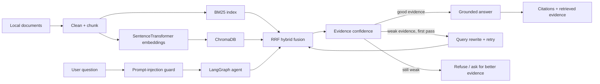

# Local Research Copilot — Hybrid RAG + Agentic Verification

A portfolio-ready local AI research assistant that combines **hybrid retrieval** (BM25 + dense embeddings + ChromaDB + Reciprocal Rank Fusion) with a small **LangGraph agent** for evidence checking, query retry, grounded answers, citations, and low-confidence refusal.

The project is intentionally local-first: retrieval runs without paid APIs, and answer generation can use either a local Ollama model or an extractive fallback.

## Why this project exists

Many RAG demos stop at “embed documents and ask a question.” This repo focuses on the engineering pieces that make a retrieval system easier to evaluate and trust:

- deterministic ingestion and metadata preservation;
- lexical + semantic retrieval rather than a single retrieval method;
- RRF rank fusion;
- citation-first answer generation;
- prompt-injection checks for user input and retrieved context;
- evidence-confidence routing and a safe “not enough evidence” path;
- retry/query-rewrite behaviour in a LangGraph workflow;
- retrieval metrics (Precision@K, Recall@K, Hit@K, MRR);
- unit tests and CI.

## Architecture



## Features

- **Document ingestion:** Markdown, text, and PDF.
- **Chunking:** configurable word chunks with overlap; document IDs and source metadata are preserved.
- **BM25 retrieval:** strong lexical baseline.
- **Dense retrieval:** `sentence-transformers/all-MiniLM-L6-v2`.
- **Vector store:** persistent ChromaDB collection.
- **Hybrid retrieval:** Reciprocal Rank Fusion (RRF) over BM25 and Chroma results.
- **Agent graph:** guard → retrieve → assess → answer / rewrite → retry / refuse.
- **Grounding:** retrieved text is treated as untrusted evidence, not instructions.
- **Local LLM:** optional Ollama generation; no API key required.
- **Fallback mode:** without Ollama, the system still works as an extractive evidence assistant.
- **Evaluation:** Precision@K, Recall@K, Hit@K and MRR.
- **Demo UI:** Streamlit chat interface.
- **CI:** lightweight tests on every push.

## Project structure

```text
rag-agent-research-copilot/
├── src/copilot/
│   ├── agent.py
│   ├── cli.py
│   ├── config.py
│   ├── evaluation.py
│   ├── guardrails.py
│   ├── ingest.py
│   ├── knowledge_base.py
│   ├── llm.py
│   ├── models.py
│   └── retrieval/
│       ├── bm25.py
│       ├── chroma.py
│       └── hybrid.py
├── data/
│   ├── sample_docs/
│   └── eval/questions.jsonl
├── tests/
├── streamlit_app.py
├── pyproject.toml
├── requirements.txt
└── .github/workflows/tests.yml
```

## Quick start

### 1. Create an environment

```bash
python -m venv .venv
source .venv/bin/activate       # macOS/Linux
# .venv\\Scripts\\activate      # Windows PowerShell
pip install -r requirements.txt
pip install -e .
```

### 2. Build the sample knowledge base

```bash
research-copilot index data/sample_docs
```

The first run downloads `all-MiniLM-L6-v2` from Hugging Face.

### 3. Ask a question

```bash
research-copilot ask "Why can hybrid retrieval outperform BM25 alone?"
```

### 4. Run evaluation

```bash
research-copilot eval data/eval/questions.jsonl --k 3
```

### 5. Launch the UI

```bash
streamlit run streamlit_app.py
```

## Optional: local Ollama generation

Retrieval works without an LLM. To add generated answers, install Ollama and pull a local model, for example:

```bash
ollama pull qwen2.5:7b
```

Then:

```bash
export COPILOT_LLM_PROVIDER=ollama
export COPILOT_OLLAMA_MODEL=qwen2.5:7b
research-copilot ask "How does the system reduce hallucination risk?"
```

On Windows PowerShell:

```powershell
$env:COPILOT_LLM_PROVIDER="ollama"
$env:COPILOT_OLLAMA_MODEL="qwen2.5:7b"
```

## Example output

```text
Question: How does the system reduce hallucination risk?
Route: answer
Confidence: 0.78

Answer:
The assistant reduces hallucination risk by retrieving evidence before generation,
requiring source citations, treating retrieved text as untrusted data, and refusing
to answer when the evidence score remains weak after a retry.

Sources:
[rag_safety.md#chunk-000]
[evaluation.md#chunk-001]
```

## Evaluation design

Each JSONL test case contains:

```json
{"question": "What does RRF combine?", "relevant_doc_ids": ["hybrid_retrieval"]}
```

For the top `K` retrieved chunks the evaluator reports:

- `precision@k`: relevant retrieved documents / K
- `recall@k`: relevant retrieved documents / all relevant documents
- `hit@k`: whether at least one relevant document was found
- `mrr`: reciprocal rank of the first relevant result

This makes retrieval quality measurable independently of answer fluency.

## Safety / robustness notes

The guardrail is intentionally simple and explainable. It checks common prompt-injection patterns in user queries and retrieved chunks, removes suspicious evidence from the answering context, and keeps the system prompt authoritative. It is **not** a complete security boundary; production systems should add stronger content isolation, tool permissions, provenance checks, observability, and red-team testing.

## Portfolio talking points

This repository demonstrates:

- information retrieval and ranking;
- vector databases and embedding models;
- agentic control flow with LangGraph;
- local LLM integration;
- defensive prompt engineering;
- evaluation design and reproducibility;
- modular Python engineering and automated testing.

## Academic integrity

This is a standalone portfolio implementation. If you adapt ideas from university coursework, keep the code and documentation original and do not publish assessment materials, hidden test cases, or course-provided solutions.

## License

MIT
