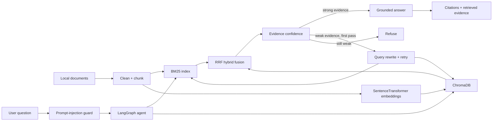

# Local Research Copilot — Hybrid RAG + Agentic Verification

[](https://github.com/MEIYI-Lu/local-research-copilot/actions/workflows/tests.yml)


A local-first research assistant that combines **BM25 lexical retrieval**, **dense embeddings**, **ChromaDB**, and **Reciprocal Rank Fusion (RRF)** with a small **LangGraph agent** that checks evidence before deciding whether to answer, retry retrieval, or refuse.

The project is designed as a reproducible portfolio implementation rather than a single-notebook RAG demo. It includes a command-line interface, Streamlit web app, retrieval benchmarking, tests, CI, prompt-injection checks, citation grounding, and a zero-API extractive fallback.

## Demo

The agent refuses to answer when the indexed evidence is too weak instead of guessing:


## Why this project exists

Many RAG examples stop at “embed documents and ask a question.” This project focuses on the engineering decisions that make retrieval behavior easier to inspect and evaluate:

- lexical + semantic retrieval instead of relying on one retriever;
- RRF to fuse rankings without comparing incompatible raw scores;
- persistent local vector storage with ChromaDB;
- explicit evidence-confidence routing;
- one retrieval retry using a rewritten query;
- grounded answers with chunk-level citations;
- refusal when evidence remains weak;
- prompt-injection checks on both user input and retrieved evidence;
- reproducible BM25 vs dense vs hybrid retrieval metrics;
- automated tests and GitHub Actions.

## Architecture



### What makes the workflow agentic?

The system does more than call a retriever once. The LangGraph state records the current query, retrieved evidence, confidence, retry count, route, answer, and citations. Based on that state, it selects the next action:

```text
question
   ↓
guard
   ↓
retrieve
   ↓
assess evidence
   ├── strong ─────────────→ answer
   └── weak
        ├── first attempt ─→ rewrite → retrieve again
        └── after retry ───→ refuse
```

The default non-LLM mode still performs a deterministic keyword rewrite, so the retry branch is real rather than simply repeating the identical query.

## Features

- **Document ingestion:** Markdown, plain text, and PDF.
- **Chunking:** configurable word chunks with overlap and preserved source metadata.
- **BM25 retrieval:** lexical baseline for exact terms and identifiers.
- **Dense retrieval:** `sentence-transformers/all-MiniLM-L6-v2`.
- **Vector store:** persistent ChromaDB collection.
- **Hybrid retrieval:** Reciprocal Rank Fusion across BM25 and dense rankings.
- **Agent routing:** guard → retrieve → assess → answer / rewrite → retry / refuse.
- **Prompt-injection filtering:** suspicious input and retrieved chunks are treated as untrusted.
- **Grounded fallback:** focused extractive answers work without a paid API or local LLM.
- **Optional local generation:** Ollama can generate more natural answers while remaining evidence-grounded.
- **Evaluation:** BM25, dense, and hybrid retrieval are compared using Precision@K, Recall@K, Hit@K, and MRR.
- **Demo UI:** Streamlit chat interface with example questions, confidence display, conversation history, and evidence scores.
- **CI:** lightweight tests on every push and pull request.

## Project structure

```text
local-research-copilot/
├── .github/
│   └── workflows/
│       └── tests.yml
├── assets/
│   └── demo-refusal.png
├── data/
│   ├── eval/
│   │   └── questions.jsonl
│   └── sample_docs/
├── src/
│   └── copilot/
│       ├── retrieval/
│       │   ├── bm25.py
│       │   ├── chroma.py
│       │   └── hybrid.py
│       ├── agent.py
│       ├── cli.py
│       ├── config.py
│       ├── evaluation.py
│       ├── guardrails.py
│       ├── ingest.py
│       ├── knowledge_base.py
│       ├── llm.py
│       └── models.py
├── tests/
├── streamlit_app.py
├── pyproject.toml
├── requirements.txt
└── README.md
```

## Quick start — local computer

### 1. Create and activate a virtual environment

**macOS / Linux**

```bash
python -m venv .venv
source .venv/bin/activate
```

**Windows PowerShell**

```powershell
python -m venv .venv
.\.venv\Scripts\Activate.ps1
```

### 2. Install the project

```bash
pip install -r requirements.txt
pip install -e .
```

### 3. Run tests

```bash
pytest -q
```

### 4. Build the sample knowledge base

```bash
research-copilot index data/sample_docs
```

The first run downloads `all-MiniLM-L6-v2` from Hugging Face.

### 5. Ask a question

```bash
research-copilot ask "What is Reciprocal Rank Fusion?"
```

### 6. Launch the web app

```bash
streamlit run streamlit_app.py
```

## GitHub Codespaces

Codespaces already runs inside an isolated cloud development environment, so creating another `.venv` is optional and can waste several gigabytes of storage.

Use the existing Codespaces Python environment and disable the pip download cache:

```bash
pip install --no-cache-dir -r requirements.txt
pip install -e . --no-deps
pytest -q
research-copilot index data/sample_docs
streamlit run streamlit_app.py --server.address 0.0.0.0 --server.port 8501
```

When Codespaces detects port `8501`, choose **Open in Browser**.

If disk space is tight, inspect it with:

```bash
df -h
```

and clear the pip cache if necessary:

```bash
python -m pip cache purge
```

## Retrieval benchmark

The included labelled question set can be used to compare all three retrievers on exactly the same queries:

```bash
research-copilot eval data/eval/questions.jsonl --k 3
```

The command prints a comparison table for:

- **BM25**
- **Dense retrieval**
- **Hybrid RRF**

using:

- **Precision@K:** proportion of the top-K retrieved documents that are relevant;
- **Recall@K:** proportion of known relevant documents that were retrieved;
- **Hit@K:** whether at least one relevant document appears in the top K;
- **MRR:** reciprocal rank of the first relevant result.

Keeping retrieval evaluation separate from answer fluency makes it possible to tell whether an improvement actually comes from better retrieval rather than nicer wording.

## Default extractive mode

The default configuration does **not** require an API key or local generative model:

```text
COPILOT_LLM_PROVIDER=extractive
```

The system selects question-relevant sentences from retrieved evidence, removes Markdown headings, and attaches chunk citations. This makes the repository runnable on a clean machine before an LLM is configured.

## Optional Ollama generation

To use a local generative model, install Ollama and pull a model such as:

```bash
ollama pull qwen2.5:7b
```

Then set:

**macOS / Linux**

```bash
export COPILOT_LLM_PROVIDER=ollama
export COPILOT_OLLAMA_MODEL=qwen2.5:7b
```

**Windows PowerShell**

```powershell
$env:COPILOT_LLM_PROVIDER="ollama"
$env:COPILOT_OLLAMA_MODEL="qwen2.5:7b"
```

Then ask normally:

```bash
research-copilot ask "How does the system reduce hallucination risk?"
```

If Ollama is unavailable, answer generation falls back to the grounded extractive mode.

## Safety and robustness

Retrieved documents are treated as **untrusted evidence, not instructions**. The project checks common prompt-injection patterns in user queries and retrieved chunks before answer generation.

The guardrail is intentionally simple and explainable. It is not a production security boundary. A production deployment should add stronger content isolation, provenance checks, least-privilege tool permissions, observability, and adversarial testing.

## Example behaviors

A question supported by the sample knowledge base should route to `answer` with citations:

```text
What is Reciprocal Rank Fusion?
→ retrieve BM25 + dense candidates
→ fuse rankings with RRF
→ sufficient evidence
→ answer + citations
```

A question outside the knowledge base should have low evidence confidence and route to `refuse` rather than relying on unrelated model knowledge:

```text
What is the capital of Brazil?
→ weak retrieved evidence
→ query rewrite + retry
→ evidence still weak
→ refuse
```

## Portfolio talking points

This repository demonstrates practical work with:

- information retrieval and ranking;
- embedding models and vector databases;
- hybrid RAG architecture;
- LangGraph state and conditional routing;
- grounded answer generation and citations;
- prompt-injection defence;
- retrieval evaluation and reproducibility;
- Streamlit application development;
- modular Python packaging, testing, and CI.

## Academic integrity

This is a standalone portfolio implementation. If techniques learned in university coursework are reused, the implementation and documentation should remain original, and course-provided assessment materials, hidden tests, datasets with restricted distribution, or submitted assessment solutions should not be published here.

## License

MIT
